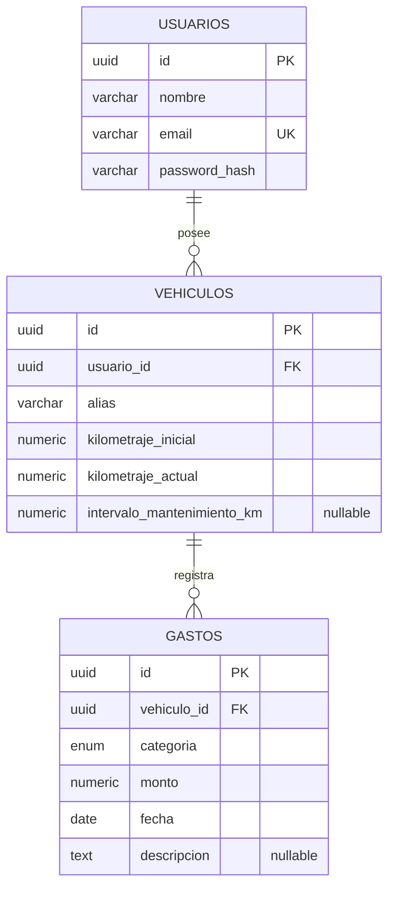

# Arquitectura de datos — Gestor Inteligente de Vehículos

> Este documento define el esquema de base de datos relacional del proyecto, correspondiente a la 2.ª entrega del TPI.

---

## 1. Diagrama entidad-relación

---

## 2. Diccionario de datos

### 2.1 `usuarios`

| Campo | Tipo | Restricciones | Descripción |
|---|---|---|---|
| id | UUID | PK, default `gen_random_uuid()` | Identificador único del usuario |
| nombre | varchar | NOT NULL | Nombre del usuario propietario |
| email | varchar | NOT NULL, UNIQUE | Usado para autenticación |
| password_hash | varchar | NOT NULL | Contraseña hasheada |

### 2.2 `vehiculos`

| Campo | Tipo | Restricciones | Descripción |
|---|---|---|---|
| id | UUID | PK, default `gen_random_uuid()` | Identificador único del vehículo |
| usuario_id | UUID | FK → `usuarios.id`, NOT NULL | Propietario del vehículo |
| alias | varchar | NOT NULL | Nombre para distinguir vehículos cuando el usuario tiene más de uno |
| kilometraje_inicial | numeric | NOT NULL | Kilometraje al momento del alta. Fijo — base para el cálculo de costo por km |
| kilometraje_actual | numeric | NOT NULL | Kilometraje vigente. Editable por el usuario; se inicializa igual a `kilometraje_inicial` al crear el vehículo |
| intervalo_mantenimiento_km | numeric | NULLABLE | Intervalo cargado por el usuario (ej. cada 10.000 km) para estimar el próximo mantenimiento. Nullable porque puede no estar cargado aún |

### 2.3 `gastos`

| Campo | Tipo | Restricciones | Descripción |
|---|---|---|---|
| id | UUID | PK, default `gen_random_uuid()` | Identificador único del gasto |
| vehiculo_id | UUID | FK → `vehiculos.id`, NOT NULL | Vehículo al que corresponde el gasto |
| categoria | enum (`combustible`, `mantenimiento`, `reparacion`, `otro`) | NOT NULL | Categoría del gasto |
| monto | numeric | NOT NULL | Monto del gasto |
| fecha | date | NOT NULL | Fecha del gasto |
| descripcion | text | NULLABLE | Detalle opcional |

---

## 3. Relaciones

- **`usuarios` 1:N `vehiculos`** — un usuario puede gestionar uno o varios vehículos; cada vehículo pertenece a un único usuario.
- **`vehiculos` 1:N `gastos`** — cada gasto (combustible, mantenimiento, reparación u otro) queda asociado a un único vehículo, permitiendo calcular indicadores por vehículo de forma independiente.

---

## 4. Decisiones de diseño

- **Gastos en una única tabla con campo `categoria`**, en vez de una tabla por categoría: las cuatro categorías comparten los mismos atributos (monto, fecha, descripción) y todos los indicadores se resuelven agrupando por `categoria`, sin necesitar estructuras distintas por tipo de gasto.
- **Sin campos específicos por categoría** (por ejemplo, litros o precio por litro en combustible): ninguna funcionalidad del MVP los requiere — el costo por km usa el monto total. Agregarlos sería una ampliación de alcance no pedida.
- **`intervalo_mantenimiento_km` como campo único en `vehiculos`**, no como entidad aparte: se especifica un único intervalo cargado por el usuario, no una lista de tipos de mantenimiento con intervalos propios.
- **Kilometraje resuelto en `vehiculos` (`kilometraje_inicial` / `kilometraje_actual`)**, no en `gastos`: evita depender de que el usuario cargue el odómetro en cada gasto, algo frágil dado que los datos históricos pueden ser incompletos. `kilometraje_actual` se actualiza manualmente por el usuario, sin relación automática con la carga de gastos.
- **Heurística "reparar o reemplazar"** se resuelve con los datos ya modelados en `gastos` y `vehiculos` (gasto acumulado, kilometraje), sin campos adicionales — se excluye explícitamente valor de mercado y tasación del vehículo.

### 4.1 Decisiones técnicas

Se utilizará `ON DELETE CASCADE` en las relaciones de dependencia entre usuario, vehículo y gastos. Los tipos numéricos y longitudes de campos se definieron según necesidades técnicas de implementación y podrán ajustarse sin modificar el modelo conceptual.

---

## 5. Validación de cobertura contra el MVP

| Funcionalidad | Resuelta con |
|---|---|
| Gestión de uno o varios vehículos por usuario | `vehiculos.usuario_id` |
| Registro de combustible / mantenimiento / reparaciones / otros gastos | `gastos.categoria` |
| Costo real por km | `SUM(gastos.monto) / (vehiculos.kilometraje_actual - vehiculos.kilometraje_inicial)` |
| Gasto acumulado por categoría | `gastos` agrupado por `categoria` |
| Comparación de combustible vs. promedio histórico propio | `gastos` filtrado por `categoria = 'combustible'`, agrupado por `vehiculo_id` y `fecha` |
| Estimación de próximo mantenimiento por kilometraje | `vehiculos.intervalo_mantenimiento_km` + `vehiculos.kilometraje_actual` |
| Heurística "reparar o reemplazar" | Agregaciones sobre `gastos` y `vehiculos`, sin datos externos |

Las nueve funcionalidades del MVP quedan cubiertas por las tres entidades definidas, sin campos ni tablas adicionales.