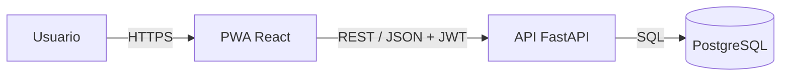

# Arquitectura de datos — Gestor Inteligente de Vehículos

> Este documento define el esquema de base de datos relacional del proyecto, correspondiente a la 2.ª entrega del TPI.

---

## Parte 1 - Arquitectura de la aplicación

### 1.1 Tipo de arquitectura elegida

Se propone una **arquitectura cliente-servidor en 3 capas**:

| Capa | Componente | Responsabilidad |
|---|---|---|
| Presentación | PWA (React + TypeScript + Vite) | Interfaz de usuario, formularios de carga, gráficos y estado local |
| Lógica de negocio | API REST (FastAPI + Python 3.10+) | Autenticación, validaciones, cálculos e indicadores |
| Datos | PostgreSQL 15+ | Persistencia relacional y consultas agregadas |

Esta separación permite desacoplar el frontend del backend, desplegar cada componente de forma independiente y mantener el contrato de la API como interfaz estable entre ambos. Cada capa se despliega como un servicio independiente en Render, de modo que la arquitectura en capas también se refleja en la topología de despliegue.

### 1.2 Arquitectura elegida

**Cliente-servidor en 3 capas con API REST y PWA desacoplada.**

El frontend y el backend se despliegan por separado, lo que da flexibilidad para escalar o modificar cada lado sin afectar al otro.

La PWA se instala desde el navegador sin depender de tiendas de aplicaciones, requisito definido en [docs/alcance.md](alcance.md) (sección 9).

El backend expone un contrato REST reutilizable por futuros clientes (por ejemplo, una app móvil nativa en una versión posterior).

Es el estándar natural para el stack elegido (React + FastAPI). La elección de este stack también responde a un criterio de experiencia previa del equipo: en diversas asignaturas se trabajó con Python, React y FastAPI, y se busca profundizar ese conocimiento en el marco del Trabajo Final.

La decisión de implementar una PWA en lugar de una aplicación móvil nativa responde a que este tipo de solución es la habitual para aplicaciones de gestión y registro con uso ocasional, donde el usuario necesita acceder desde cualquier dispositivo sin instalar desde una tienda. Una app nativa (React Native, Flutter o similar) implicaría un tiempo adicional de aprendizaje y de investigación de un stack nuevo, que por cuestiones de tiempo quedaría fuera del plazo del Trabajo Final. Por ese motivo, el desarrollo móvil nativo queda fuera del alcance de esta versión (ver [alcance.md](alcance.md), sección 8.2), pero se contempla como una posible evolución del proyecto: el backend expone un contrato REST reutilizable, por lo que una app nativa podría incorporarse más adelante consumiendo los mismos endpoints sin requerir cambios en la API.

### 1.3 Comunicación entre capas

- **Frontend ↔ Backend:** HTTP/HTTPS con payloads JSON. Autenticación mediante JWT enviado en el header `Authorization`.

- **Backend ↔ Base de datos:** SQL sobre conexión TCP, utilizando un pool de conexiones administrado por el framework.

- **CORS:** configurado en el backend con la URL exacta del frontend desplegado, provista por la variable de entorno CORS_ORIGINS, desde el inicio del desarrollo (ver viabilidad.md, sección 4.3).

- **Contrato de la API:** endpoints REST agrupados por recurso (`/auth`, `/vehiculos`, `/gastos`, `/indicadores`).

### 1.4 Relación con los módulos

Los módulos definidos en [docs/modulos.md](modulos.md) son la materialización de esta arquitectura:

- Los módulos de la capa de presentación (Autenticación y Perfil, Gestión de Vehículos, Registro de Gastos, Dashboard y Métricas) se implementan en `frontend/`.

- Los módulos de la capa de lógica de negocio (Seguridad, Vehículos, Transacciones, Analítico y de Alertas) se implementan en `backend/`.

- Los módulos de la capa de persistencia (Usuarios, Vehículos, Gastos, Reportes) se corresponden con las entidades definidas en la Parte 2 de este documento y con el script [database/schema.sql](../database/schema.sql).

## Parte 2 - Arquitectura de datos

Esta sección define el esquema de base de datos relacional del proyecto.

---

## 1. Diagrama entidad-relación

<!-- To do: adjuntar -->

---

## 2. Diccionario de datos

### 2.1 `usuarios`

| Campo | Tipo | Restricciones | Descripción |
|---|---|---|---|
| id | UUID | PK, default `gen_random_uuid()` | Identificador único del usuario |
| nombre | varchar | NOT NULL | Nombre del usuario propietario |
| email | varchar | NOT NULL, UNIQUE | Usado para autenticación |
| password_hash | varchar | NOT NULL | Contraseña hasheada |

### 2.2 `vehiculos`

| Campo | Tipo | Restricciones | Descripción |
|---|---|---|---|
| id | UUID | PK, default `gen_random_uuid()` | Identificador único del vehículo |
| usuario_id | UUID | FK → `usuarios.id`, NOT NULL | Propietario del vehículo |
| alias | varchar | NOT NULL | Nombre para distinguir vehículos cuando el usuario tiene más de uno |
| kilometraje_inicial | numeric | NOT NULL | Kilometraje al momento del alta. Fijo — base para el cálculo de costo por km |
| kilometraje_actual | numeric | NOT NULL | Kilometraje vigente. Editable por el usuario; se inicializa igual a `kilometraje_inicial` al crear el vehículo |
| intervalo_mantenimiento_km | numeric | NULLABLE | Intervalo cargado por el usuario (ej. cada 10.000 km) para estimar el próximo mantenimiento. Nullable porque puede no estar cargado aún |

### 2.3 `gastos`

| Campo | Tipo | Restricciones | Descripción |
|---|---|---|---|
| id | UUID | PK, default `gen_random_uuid()` | Identificador único del gasto |
| vehiculo_id | UUID | FK → `vehiculos.id`, NOT NULL | Vehículo al que corresponde el gasto |
| categoria | enum (`combustible`, `mantenimiento`, `reparacion`, `otro`) | NOT NULL | Categoría del gasto |
| monto | numeric | NOT NULL | Monto del gasto |
| fecha | date | NOT NULL | Fecha del gasto |
| descripcion | text | NULLABLE | Detalle opcional |

---

## 3. Relaciones

- **`usuarios` 1:N `vehiculos`** — un usuario puede gestionar uno o varios vehículos; cada vehículo pertenece a un único usuario.
- **`vehiculos` 1:N `gastos`** — cada gasto (combustible, mantenimiento, reparación u otro) queda asociado a un único vehículo, permitiendo calcular indicadores por vehículo de forma independiente.

---

## 4. Decisiones de diseño

- **Gastos en una única tabla con campo `categoria`**, en vez de una tabla por categoría: las cuatro categorías comparten los mismos atributos (monto, fecha, descripción) y todos los indicadores se resuelven agrupando por `categoria`, sin necesitar estructuras distintas por tipo de gasto.
- **Sin campos específicos por categoría** (por ejemplo, litros o precio por litro en combustible): ninguna funcionalidad del MVP los requiere — el costo por km usa el monto total. Agregarlos sería una ampliación de alcance no pedida.
- **`intervalo_mantenimiento_km` como campo único en `vehiculos`**, no como entidad aparte: se especifica un único intervalo cargado por el usuario, no una lista de tipos de mantenimiento con intervalos propios.
- **Kilometraje resuelto en `vehiculos` (`kilometraje_inicial` / `kilometraje_actual`)**, no en `gastos`: evita depender de que el usuario cargue el odómetro en cada gasto, algo frágil dado que los datos históricos pueden ser incompletos. `kilometraje_actual` se actualiza manualmente por el usuario, sin relación automática con la carga de gastos.
- **Heurística "reparar o reemplazar"** se resuelve con los datos ya modelados en `gastos` y `vehiculos` (gasto acumulado, kilometraje), sin campos adicionales — se excluye explícitamente valor de mercado y tasación del vehículo.

### 4.1 Decisiones técnicas

Se utilizará `ON DELETE CASCADE` en las relaciones de dependencia entre usuario, vehículo y gastos. Los tipos numéricos y longitudes de campos se definieron según necesidades técnicas de implementación y podrán ajustarse sin modificar el modelo conceptual.

---

## 5. Validación de cobertura contra el MVP

| Funcionalidad | Resuelta con |
|---|---|
| Gestión de uno o varios vehículos por usuario | `vehiculos.usuario_id` |
| Registro de combustible / mantenimiento / reparaciones / otros gastos | `gastos.categoria` |
| Costo real por km | `SUM(gastos.monto) / (vehiculos.kilometraje_actual - vehiculos.kilometraje_inicial)` |
| Gasto acumulado por categoría | `gastos` agrupado por `categoria` |
| Comparación de combustible vs. promedio histórico propio | `gastos` filtrado por `categoria = 'combustible'`, agrupado por `vehiculo_id` y `fecha` |
| Estimación de próximo mantenimiento por kilometraje | `vehiculos.intervalo_mantenimiento_km` + `vehiculos.kilometraje_actual` |
| Heurística "reparar o reemplazar" | Agregaciones sobre `gastos` y `vehiculos`, sin datos externos |

Las nueve funcionalidades del MVP quedan cubiertas por las tres entidades definidas, sin campos ni tablas adicionales.