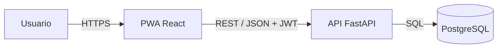

# Arquitectura — Gestor Inteligente de Vehículos

> Este documento define la arquitectura de la aplicación (capas, componentes y comunicación entre ellos) del proyecto, correspondiente a la 2.ª entrega del TPI.

---

## Parte 1 - Arquitectura de la aplicación

### 1.1 Tipo de arquitectura elegida

Se propone una **arquitectura cliente-servidor en 3 capas**:

| Capa | Componente | Responsabilidad |
|---|---|---|
| Presentación | PWA (React + TypeScript + Vite) | Interfaz de usuario, formularios de carga, gráficos y estado local |
| Lógica de negocio | API REST (FastAPI + Python 3.10+) | Autenticación, validaciones, cálculos e indicadores |
| Datos | PostgreSQL 15+ | Persistencia relacional y consultas agregadas |

```mermaid
flowchart LR
    U[Usuario] -->|HTTPS| PWA[PWA React]
    PWA -->|REST / JSON + JWT| API[API FastAPI]
    API -->|SQL| DB[(PostgreSQL)]
```

Esta separación permite desacoplar el frontend del backend, desplegar cada componente de forma independiente y mantener el contrato de la API como interfaz estable entre ambos. Cada capa se despliega como un servicio independiente en Render, de modo que la arquitectura en capas también se refleja en la topología de despliegue.

### 1.2 Arquitectura elegida

**Cliente-servidor en 3 capas con API REST y PWA desacoplada.**

El frontend y el backend se despliegan por separado, lo que da flexibilidad para escalar o modificar cada lado sin afectar al otro.

La PWA se instala desde el navegador sin depender de tiendas de aplicaciones, requisito definido en [alcance.md](alcance.md) (sección 9).

El backend expone un contrato REST reutilizable por futuros clientes (por ejemplo, una app móvil nativa en una versión posterior).

Es el estándar natural para el stack elegido (React + FastAPI). La elección de este stack también responde a un criterio de experiencia previa del equipo: en diversas asignaturas se trabajó con Python, React y FastAPI, y se busca profundizar ese conocimiento en el marco del Trabajo Final.

La decisión de implementar una PWA en lugar de una aplicación móvil nativa responde a que este tipo de solución es la habitual para aplicaciones de gestión y registro con uso ocasional, donde el usuario necesita acceder desde cualquier dispositivo sin instalar desde una tienda. Una app nativa (React Native, Flutter o similar) implicaría un tiempo adicional de aprendizaje y de investigación de un stack nuevo, que por cuestiones de tiempo quedaría fuera del plazo del Trabajo Final. Por ese motivo, el desarrollo móvil nativo queda fuera del alcance de esta versión (ver [alcance.md](alcance.md), sección 8.2), pero se contempla como una posible evolución del proyecto: el backend expone un contrato REST reutilizable, por lo que una app nativa podría incorporarse más adelante consumiendo los mismos endpoints sin requerir cambios en la API.

### 1.3 Comunicación entre capas

- **Frontend ↔ Backend:** HTTP/HTTPS con payloads JSON. Autenticación mediante JWT enviado en el header `Authorization`.

- **Backend ↔ Base de datos:** SQL sobre conexión TCP, utilizando un pool de conexiones administrado por el framework.

- **CORS:** configurado en el backend con la URL exacta del frontend desplegado, provista por la variable de entorno `CORS_ORIGINS`, desde el inicio del desarrollo (ver [viabilidad.md](viabilidad.md), sección 4.3).

- **Contrato de la API:** endpoints REST agrupados por recurso (`/auth`, `/vehiculos`, `/gastos`, `/indicadores`).

### 1.4 Relación con los módulos

Los módulos definidos en [modulos.md](modulos.md) son la materialización de esta arquitectura:

- Los módulos de la capa de presentación (Autenticación y Perfil, Gestión de Vehículos, Registro de Gastos, Dashboard y Métricas) se implementan en `frontend/`.

- Los módulos de la capa de lógica de negocio (Seguridad, Vehículos, Transacciones, Analítico y de Alertas) se implementan en `backend/`.

- Los módulos de la capa de persistencia (Usuarios, Vehículos, Gastos, Reportes) se apoyan en el modelo de datos detallado en [esquema-db.md](esquema-db.md) y en el script [database/schema.sql](../database/schema.sql). El módulo de Reportes no tiene entidad propia porque se resuelve con consultas agregadas sobre `gastos` y `vehiculos`.