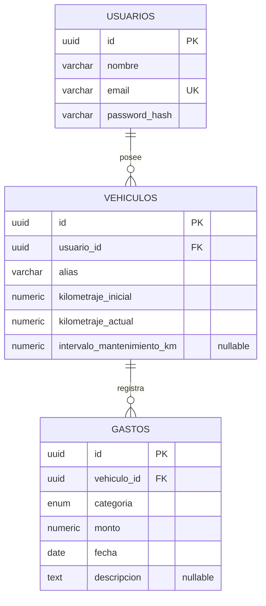

# Esquema de la base de datos

> Este documento define el modelo relacional del proyecto y reúne todo lo referente a la persistencia, validaciones y relaciones entre entidades.

---

## 1. Tecnología

La aplicación utiliza PostgreSQL como motor de base de datos relacional. El esquema principal se encuentra en [database/schema.sql](../database/schema.sql).

## 2. Diagrama entidad-relación

---

## 3. Diccionario de datos

### 3.1 `usuarios`

| Campo | Tipo | Restricciones | Descripción |
|---|---|---|---|
| id | UUID | PK, default `gen_random_uuid()` | Identificador único del usuario |
| nombre | varchar | NOT NULL, `CHECK (btrim(nombre) <> '')` | Nombre del usuario propietario |
| email | varchar | NOT NULL, UNIQUE, `CHECK` de formato | Usado para autenticación |
| password_hash | varchar | NOT NULL | Contraseña hasheada |

### 3.2 `vehiculos`

| Campo | Tipo | Restricciones | Descripción |
|---|---|---|---|
| id | UUID | PK, default `gen_random_uuid()` | Identificador único del vehículo |
| usuario_id | UUID | FK → `usuarios.id`, NOT NULL | Propietario del vehículo |
| alias | varchar | NOT NULL, `CHECK (btrim(alias) <> '')` | Nombre para distinguir vehículos cuando el usuario tiene más de uno |
| kilometraje_inicial | numeric | NOT NULL, `CHECK (kilometraje_inicial >= 0)` | Kilometraje al momento del alta. Fijo — base para el cálculo de costo por km |
| kilometraje_actual | numeric | NOT NULL, `CHECK (kilometraje_actual >= 0)`, `CHECK (kilometraje_actual >= kilometraje_inicial)` | Kilometraje vigente. Editable por el usuario; se inicializa igual a `kilometraje_inicial` al crear el vehículo |
| intervalo_mantenimiento_km | numeric | NULLABLE, `CHECK (intervalo_mantenimiento_km IS NULL OR intervalo_mantenimiento_km > 0)` | Intervalo cargado por el usuario (ej. cada 10.000 km) para estimar el próximo mantenimiento. Nullable porque puede no estar cargado aún |

### 3.3 `gastos`

| Campo | Tipo | Restricciones | Descripción |
|---|---|---|---|
| id | UUID | PK, default `gen_random_uuid()` | Identificador único del gasto |
| vehiculo_id | UUID | FK → `vehiculos.id`, NOT NULL | Vehículo al que corresponde el gasto |
| categoria | enum (`combustible`, `mantenimiento`, `reparacion`, `otro`) | NOT NULL | Categoría del gasto |
| monto | numeric | NOT NULL, `CHECK (monto > 0)` | Monto del gasto |
| fecha | date | NOT NULL, `CHECK (fecha <= CURRENT_DATE)` | Fecha del gasto |
| descripcion | text | NULLABLE | Detalle opcional |

---

## 4. Relaciones

- **`usuarios` 1:N `vehiculos`** — un usuario puede gestionar uno o varios vehículos; cada vehículo pertenece a un único usuario.
- **`vehiculos` 1:N `gastos`** — cada gasto (combustible, mantenimiento, reparación u otro) queda asociado a un único vehículo, permitiendo calcular indicadores por vehículo de forma independiente.

---

## 5. Decisiones de diseño

- **Gastos en una única tabla con campo `categoria`**, en vez de una tabla por categoría: las cuatro categorías comparten los mismos atributos (monto, fecha, descripción) y todos los indicadores se resuelven agrupando por `categoria`, sin necesitar estructuras distintas por tipo de gasto.
- **Sin campos específicos por categoría** (por ejemplo, litros o precio por litro en combustible): ninguna funcionalidad del MVP los requiere — el costo por km usa el monto total. Agregarlos sería una ampliación de alcance no pedida.
- **`intervalo_mantenimiento_km` como campo único en `vehiculos`**, no como entidad aparte: se especifica un único intervalo cargado por el usuario, no una lista de tipos de mantenimiento con intervalos propios.
- **Kilometraje resuelto en `vehiculos` (`kilometraje_inicial` / `kilometraje_actual`)**, no en `gastos`: evita depender de que el usuario cargue el odómetro en cada gasto, algo frágil dado que los datos históricos pueden ser incompletos. `kilometraje_actual` se actualiza manualmente por el usuario, sin relación automática con la carga de gastos.
- **Heurística "reparar o reemplazar"** se resuelve con los datos ya modelados en `gastos` y `vehiculos` (gasto acumulado, kilometraje), sin campos adicionales — se excluye explícitamente valor de mercado y tasación del vehículo.

### 5.1 Decisiones técnicas

Se utilizará `ON DELETE CASCADE` en las relaciones de dependencia entre usuario, vehículo y gastos. Los tipos numéricos y longitudes de campos se definieron según las necesidades técnicas de implementación y podrán ajustarse sin modificar el modelo conceptual.

Las reglas de negocio se validan en las tres capas de la arquitectura:

- **UI:** validación de campos obligatorios y formatos para dar feedback inmediato al usuario.
- **Backend:** validación de reglas de negocio, permisos y pertenencia de los recursos.
- **Base de datos:** restricciones `CHECK`, `UNIQUE`, `FK` y `NOT NULL` como refuerzo de la integridad.

La validación en la base de datos no reemplaza a las anteriores, pero garantiza que inserciones por fuera de la UI (scripts de migración, datos de demostración, futuras interfaces) no puedan dejar el modelo en un estado inconsistente con las reglas definidas.

---

## 6. Reglas de integridad

- Todas las entidades poseen una clave primaria.
- Las relaciones se implementan mediante claves foráneas.
- El correo del usuario debe ser único y cumplir formato válido.
- El alias del vehículo debe ser obligatorio y no vacío.
- Los kilometrajes deben ser no negativos y coherentes con el historial del vehículo.
- Los montos de los gastos deben ser mayores a cero.
- Las fechas no pueden ser futuras.
- Al eliminar un usuario, se eliminan sus vehículos y gastos asociados.

---

## 7. Validación de cobertura contra el MVP

| Funcionalidad | Resuelta con |
|---|---|
| Gestión de uno o varios vehículos por usuario | `vehiculos.usuario_id` |
| Registro de combustible / mantenimiento / reparaciones / otros gastos | `gastos.categoria` |
| Costo real por km | `SUM(gastos.monto) / (vehiculos.kilometraje_actual - vehiculos.kilometraje_inicial)` |
| Gasto acumulado por categoría | `gastos` agrupado por `categoria` |
| Comparación de combustible vs. promedio histórico propio | `gastos` filtrado por `categoria = 'combustible'`, agrupado por `vehiculo_id` y `fecha` |
| Estimación de próximo mantenimiento por kilometraje | `vehiculos.intervalo_mantenimiento_km` + `vehiculos.kilometraje_actual` |
| Heurística "reparar o reemplazar" | Agregaciones sobre `gastos` y `vehiculos`, sin datos externos |
| Reglas de integridad (monto positivo, coherencia de kilometrajes) | Restricciones `CHECK` en `schema.sql` |

Las nueve funcionalidades del MVP quedan cubiertas por las tres entidades definidas, sin campos ni tablas adicionales. Las reglas de integridad se refuerzan con restricciones `CHECK` al nivel de base de datos.